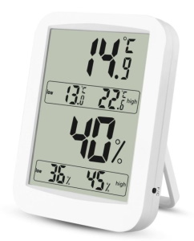

# React Hands-on Workshop

Your task is to create a climate measurement device which has an interface
similar to the following tool:



## Installation

### Prerequisites

You need [Node.js](https://nodejs.org) (version ≥ 10.x required, latest LTS
recommended) to be able to run this project.

You can use the editor/IDE of your choice, but when in doubt, we recommend
[Visual Studio Code](https://code.visualstudio.com/).

### Getting Started

1. Clone this repository
2. Install the dependencies: `npm install` / `yarn`
3. Execute `npm start` / `yarn start` to start the application stub

This should compile the app and open a browser, resulting in something like
this:


The values should be changing over time.

### Running Tests

Use `npm test` to run the tests.

By default only tests for changed files are run. This is very convenient for
development, but for a initial check press `a` to trigger a full test run.

This should show you exactly one failing test case:

```text
✕ this is a failing test on purpose to get you started
```

You can then quite the test runner with `q` for now.

---

## Assignments

When everything is up and running, move on to the [assignments](assignments.md).
